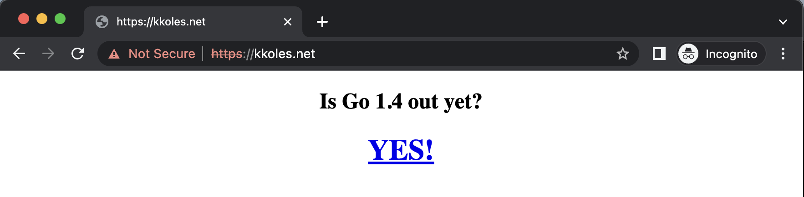
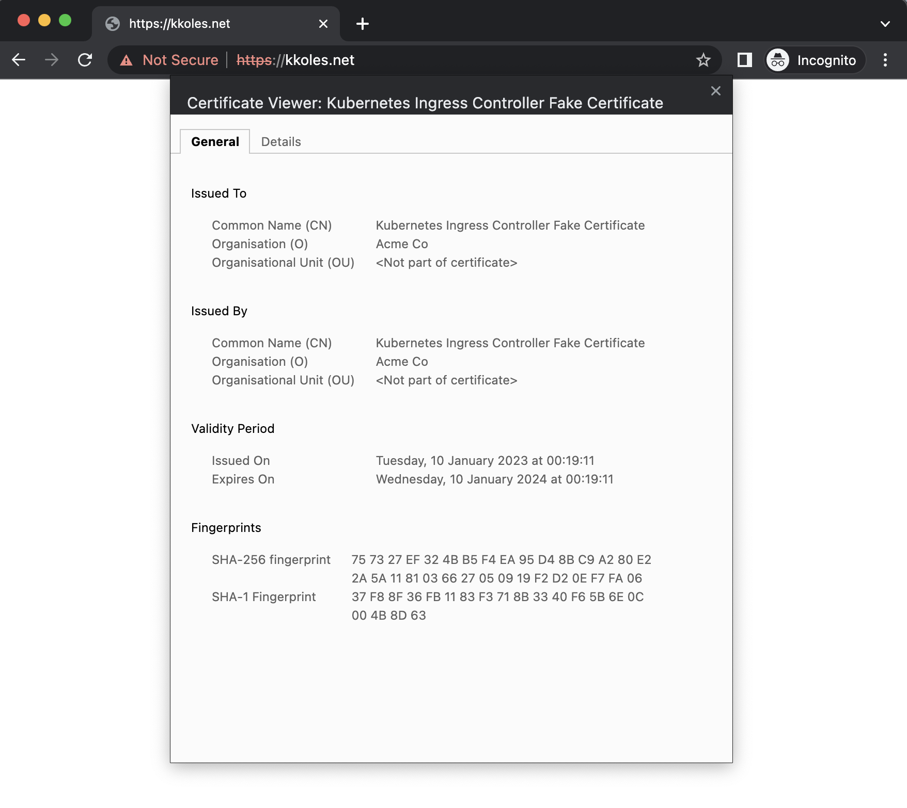
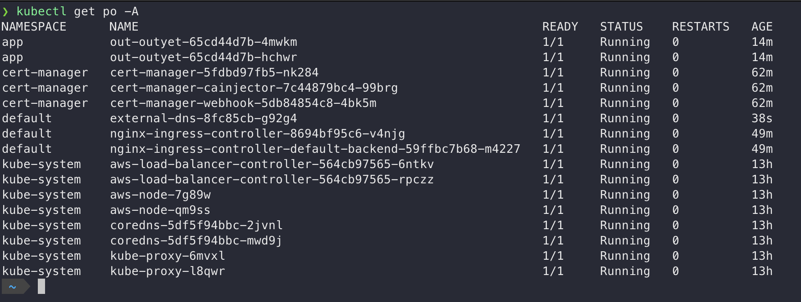

# K8S Infrastructure for Sample Go App 
App Deployment to Kubernetes as a minimal Container. The app accessible via a load balancer that automatically retrieves the certificates from Let's Encrypt

## Roadmap

### Application

A sample Go application has been used to solve this task.  

Source code of the application can be found here:
https://github.com/kkoles/go-outyet-app

I created a proper Dockerfile with a multistage build to create the image. The multistage build is necessary in this case because it helps to make a small and secure image. We can build our application in the first stage and put only the application executable into the distroless image (which contains only the necessary setup to run the go application without bash and other extra utilities). 

I used GitHub Actions to build the image because it has a nice and sample syntax and is easy to use if your source code is on GitHub.

Built image is located on DockerHub since it's free and easy to use: https://hub.docker.com/r/kkoles/outyet/tags

### Infrastructure

For this purpose, I used my own AWS EKS cluster, which was created some time ago with AWS terraform modules for EKS and VPC.

Source code can be found here: 
https://github.com/kkoles/aws-eks-infra

### Helm Chart

Helm chart is consist of:
- template for app deployment
- template for NodePort service
- template for ingress controller
- values for items above
- support functions defined in _helpers.tpl file

### TLS Offloading and Load Balancer

To issue Let's Encrypt certificates on kubernetes cluster I've manually deployed `cert-manager` and `nginx-ingress-controller` using helm.

I've manually created ClusterIssuer, by running the following command:

```kubectl apply -f cert-manager/cluster_issuer.yml```

To use this cluster_issuer my ingress-controller has the appropriate annotation.

After applying helm charts I've manually created Route53 record which points to my subdomain and after that the app can be accessible via subdomain url.

### Results

URL app access:


Certificate details:


Cluster pods:
